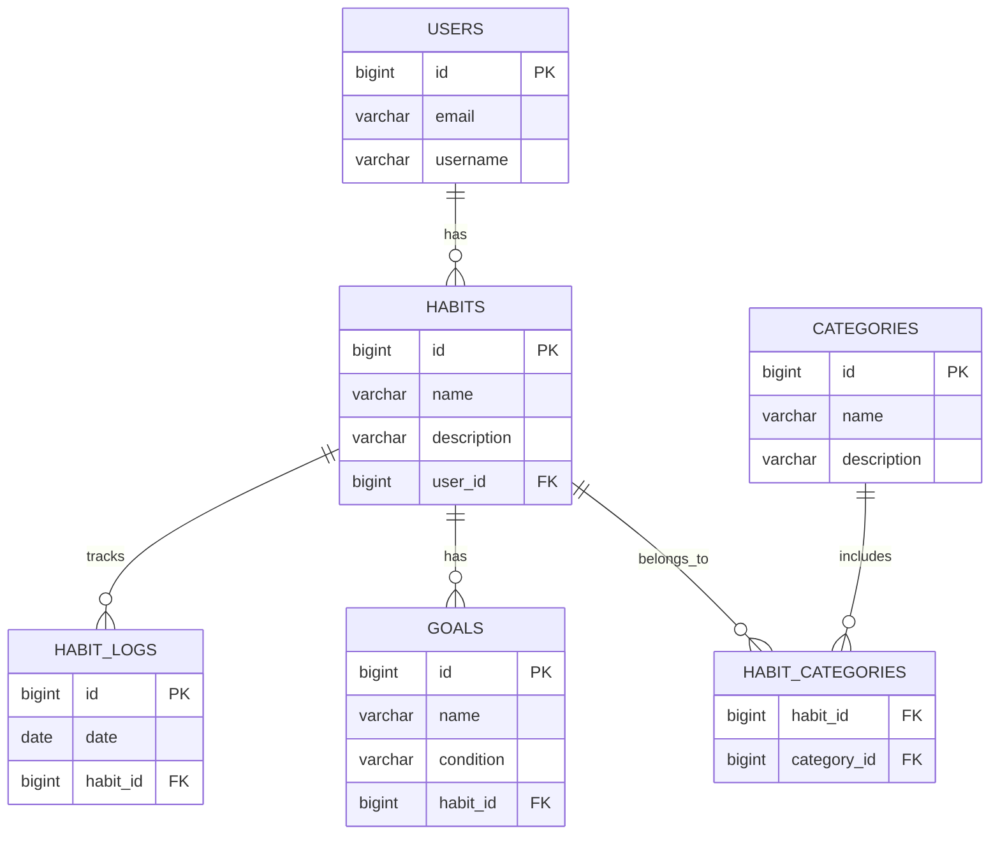

# HABIT TRACKER API

## REST API проект на Java, фреймворк Spring Boot, Maven, PostgreSQL.

* **Live Demo (PaaS Render):** [https://habittracker-app-ivdt.onrender.com/](https://habittracker-app-ivdt.onrender.com/) *(Примечание: используется бесплатный тариф Render; при первом обращении возможна задержка на запуск контейнера)*

Проект предоставляет набор готовых программных функций (API-запросов), с помощью которых можно управлять трекером привычек. Например, фронтенд-разработчик или мобильное приложение может использовать этот API, чтобы:
1. Создать пользователя
2. Создать и редактировать привычки
3. Отметить выполнение привычки
4. Посмотреть статистику выполнения
5. Управлять категориями привычек
6. Создавать цели для привычек

---

### ЛАБОРАТОРНАЯ РАБОТА 1: REST API и Базовая архитектура

1. Создать Spring Boot приложение.
2. Реализовать REST API для одной ключевой сущности своей предметной области (domain).
3. Реализовать:
   - GET endpoint с @RequestParam
   - GET endpoint с @PathVariable
4. Реализовать слои: Controller -> Service -> Repository.
5. Реализовать DTO и mapper между Entity и API-ответом.
6. Настроить Checkstyle и привести код к стилю.

---

### ЛАБОРАТОРНАЯ РАБОТА 2: Реляционная БД и Сложные связи

1. Подключить реляционную БД к проекту.
2. В модели данных реализовать минимум 5 сущностей:
   - минимум одну связь OneToMany
   - минимум одну связь ManyToMany
3. Реализовать CRUD операции.
4. Настроить и обосновать использование CascadeType и FetchType.
5. Продемонстрировать проблему N+1 и решить её через @EntityGraph или fetch join.
6. Реализовать метод, сохраняющий несколько связанных сущностей. Продемонстрировать частичное сохранение данных без @Transactional и полное откатывание операции с @Transactional при возникновении ошибки.
7. Нарисовать ER-диаграмму с указанием PK/FK и связей.

---

### ЛАБОРАТОРНАЯ РАБОТА 3: Запросы, Пагинация и Кэширование

1. Реализовать сложный GET-запрос с фильтрацией по вложенной сущности с использованием @Query (JPQL).
2. Реализовать аналогичный запрос через native query.
3. Добавить пагинацию (Pageable).
4. Реализовать in-memory индекс на основе HashMap<K, V> для ранее запрошенных данных. Ключ должен формироваться из параметров запроса (составной ключ). Обеспечить корректную работу индекса за счёт правильной реализации equals() и hashCode().
5. Реализовать инвалидацию индекса при изменении данных.

---

### ЛАБОРАТОРНАЯ РАБОТА 4: Обработка ошибок, Валидация, AOP и Логирование

1. Реализовать глобальную обработку ошибок через @ControllerAdvice.
2. Добавить валидацию входных данных через @Valid.
3. Реализовать единый формат ошибки для всех endpoint.
4. Настроить логирование через logback:
   - уровни логирования
   - ротация логов
5. Реализовать аспект (AOP) для логирования времени выполнения сервисных методов.
6. Подключить Swagger/OpenAPI с описанием endpoint и DTO.

---

### ЛАБОРАТОРНАЯ РАБОТА 5: Пакетная обработка данных и Тестирование

1. Реализовать bulk-операцию (POST со списком объектов), имеющую бизнес-смысл в рамках проекта.
2. Использовать Stream API и Optional в сервисном слое.
3. Обеспечить транзакционность bulk-операции. Продемонстрировать работу с/без @Transactional и показать разницу в состоянии БД.
4. Написать unit-тесты для сервисов (Mockito).

---

### ЛАБОРАТОРНАЯ РАБОТА 6: Многопоточность, Асинхронность и Нагрузочное тестирование

1. Реализовать асинхронную бизнес-операцию через @Async / CompletableFuture, которая:
   - возвращает ID задачи
   - позволяет проверить статус выполнения
2. Реализовать потокобезопасный счётчик (или аналогичный механизм) с использованием synchronized или Atomic.
3. Продемонстрировать возможный race condition (ExecutorService 50+ потоков) и его решение.
4. Провести нагрузочное тестирование JMeter и показать результаты.

---

### ЛАБОРАТОРНАЯ РАБОТА 7: Клиентское приложение (SPA)

1. Реализовать SPA-клиент (React / Angular / Vue).
2. Клиент должен работать с API, реализованным в лабораторных работах.
3. Отобразить связи OneToMany и ManyToMany.
4. Реализовать CRUD операции и фильтрацию.

---

### ЛАБОРАТОРНАЯ РАБОТА 8: Развертывание, Контейнеризация и CI/CD

1. Подготовить Dockerfile для приложения.
2. Подготовить Docker Compose (приложение + БД).
3. Использовать переменные окружения.
4. Разместить приложение на бесплатном хостинге (PaaS).
5. Настроить CI/CD в GitHub:
   - сборка
   - тесты
   - развертывание
   - healthcheck

---

[Сонар](https://sonarcloud.io/projects)

## ER-диаграмма

